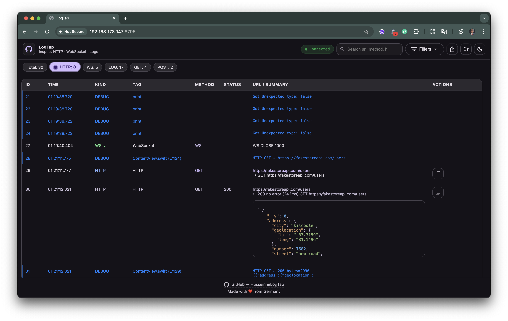
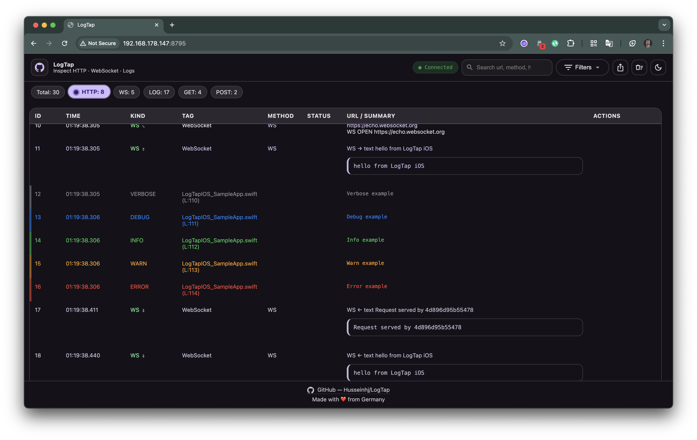
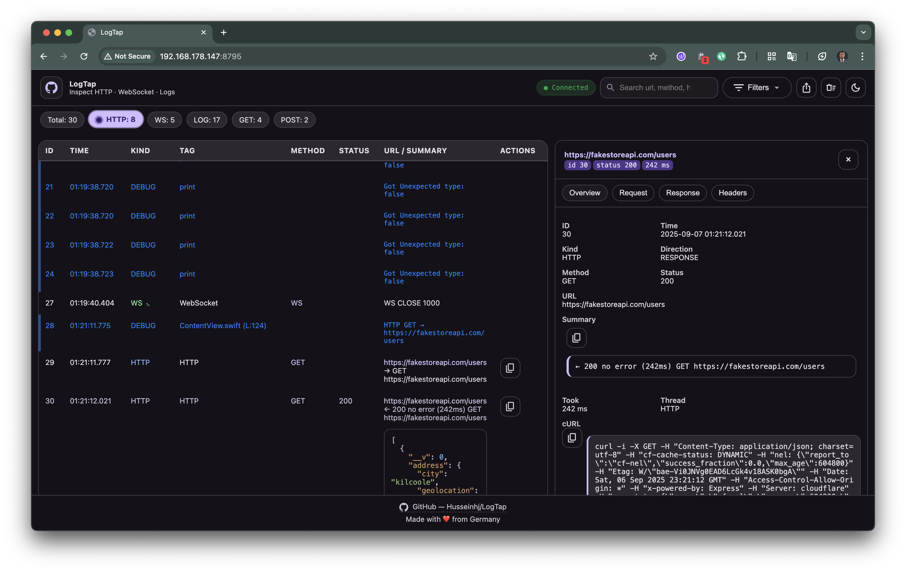
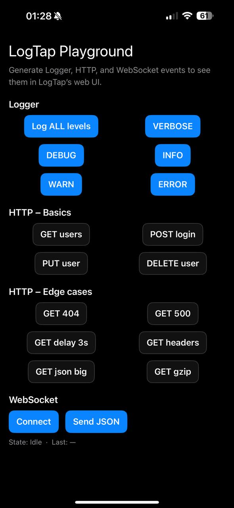

# 📡 LogTapIOS

Inspect **HTTP(S)**, **WebSocket**, and **Logger** events from your iOS, iPadOS, and macOS apps in real time — through an embedded **web UI** running directly on your device.

---

## ✨ Features

- 🚦 **HTTP Interceptor**  
  Capture all `URLSession` requests and responses using a custom `URLProtocol`.

- 🔄 **WebSocket Logging**  
  Wraps native `URLSessionWebSocketTask` to record sent and received WebSocket messages.

- 📝 **Logger Bridge**  
  Capture `print()` and custom logs (e.g., `LogTapLogger`) and stream them to the web UI.

- 🌐 **Embedded web server**  
  Lightweight [SwiftNIO](https://github.com/apple/swift-nio) server runs inside your app.  
  Access the dashboard from your desktop browser via LAN (e.g. `http://192.168.x.x:8790/`).

- 📊 **Web UI**  
  Live logs with filtering (method, status, log level), full request/response details, cURL export, multiple themes (Android Studio, Xcode, VSCode, Grafana).

- 🛡 **Safe for debug**  
  Designed for **DEBUG** builds. Easily disable in release builds.

---

## 📸 Screenshots

| Network View | Logger View | Detail Drawer | Sample app                                |
|--------------|-------------|---------------|-------------------------------------------|
|  |  |  |  |

---

## 📦 Installation

### Swift Package Manager

#### Xcode
1. Go to **File > Add Packages…**
2. Enter the repo URL:
   ```
   https://github.com/Husseinhj/LogTapIOS.git
   ```
3. Select the **LogTapIOS** library and add it to your target.

#### `Package.swift`
Add to your dependencies:
```swift
dependencies: [
    .package(url: "https://github.com/Husseinhj/LogTapIOS.git", from: "0.1.0")
]
```

---

## 🚀 Usage

### 1. Start the LogTap server
Usually in your `AppDelegate` or `@main` SwiftUI `App`:

```swift
import LogTapIOS

@main
struct MyApp: App {
    init() {
      
        #if DEBUG
          // Start LogTap server on port 8790
          var cfg = LogTap.Config()
          cfg.port = 8795
          cfg.capacity = 5000
          cfg.enableOnRelease = false
          LogTap.shared.start(cfg)
    
          // Configure LogTapLogger and only use logD, logI, logW, logE in your app
          LogTapLogger.shared.debugMode = true
          LogTapLogger.shared.allowReleaseLogging = false
          LogTapLogger.shared.minLevel = .verbose

          // Optional: Logger bridge to capture print()
          let sink = LogTapSinkAdapter()
          LogTapPrintBridge.shared.start(sink: sink)
        #else
          LogTapLogger.shared.debugMode = false
          LogTapLogger.shared.allowReleaseLogging = false
          LogTapLogger.shared.minLevel = .warn
        #endif
    }

    var body: some Scene {
        WindowGroup {
            ContentView()
        }
    }
}
```

When your app runs, LogTap will print available server URLs to the Xcode console, e.g.:
```
[DEBUG] LogTap server ready at http://192.168.178.66:8790/
```
Open that address in your desktop browser to view logs.

---

### 2. Log messages
```swift
logD("Debug example")
logI("Info example")
logW("Warn example")
logE("Error example")
```

---

### 3. Intercept HTTP(S) calls
```swift
let config = URLSessionConfiguration.default
config.protocolClasses = [LogTapURLProtocol.self] + (config.protocolClasses ?? [])
let session = URLSession(configuration: config)

let task = session.dataTask(with: URL(string: "https://fakestoreapi.com/products")!) { data, response, error in
    // Response will be logged automatically
}
task.resume()
```

---

### 4. Capture WebSocket events
```swift
let url = URL(string: "wss://echo.websocket.org")!
let ws = LogTapWebSocketTask(url: url)
ws.send(.string("{\"hello\":\"world\"}"))
```

---

## 📊 Web UI
- Filter logs by kind (HTTP / WebSocket / Logger)
- Inspect full headers, request & response bodies
- Export requests as cURL
- Switch themes: Android Studio, Xcode, VSCode, Grafana
- Works on mobile, tablet, and desktop browsers

---

## 🔒 Security
- The server binds to your device’s LAN IP.
- Anyone on the same Wi-Fi can access it if they know the URL.
- Only enable in trusted networks and DEBUG builds.
- For production: disable or restrict via configuration.

---

## 🤝 Contributing

Contributions, issues, and pull requests are welcome!  
Please open an issue first to discuss major changes.

---

## 📄 License

MIT License – see [LICENSE](LICENSE) for details.

---

## 📢 Related
- [LogTap (Android)](https://github.com/Husseinhj/LogTap) – the Android/Kotlin version of this library.
